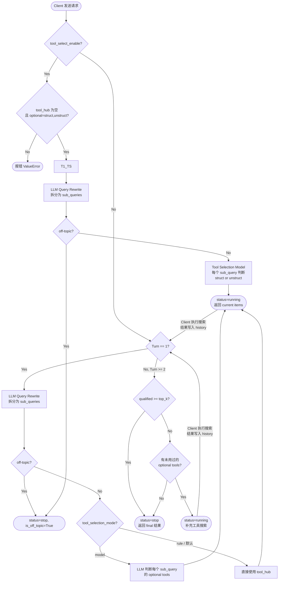
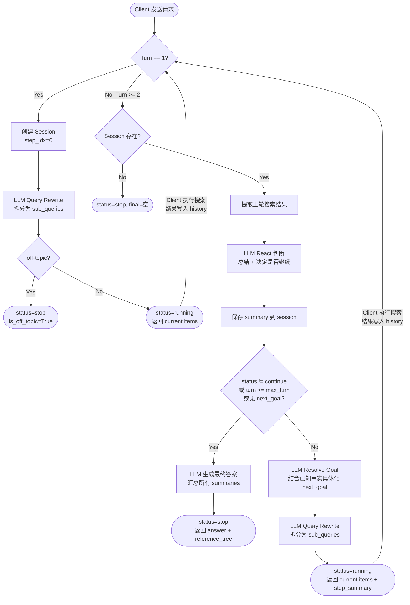
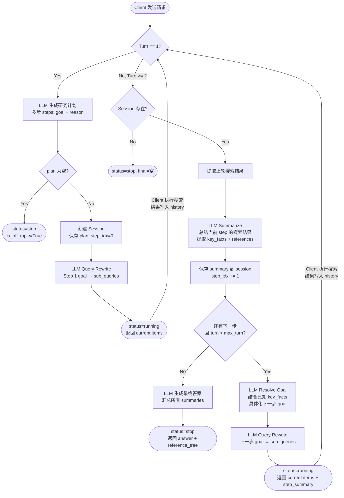
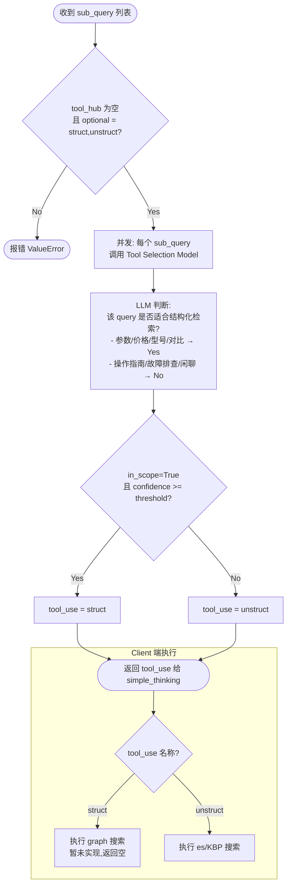

# Planning Flowcharts

## 1. Simple Thinking

```mermaid
flowchart TD
    Start([Client 发送请求]) --> Validate{tool_select_enable?}

    Validate -->|Yes| CheckParams{tool_hub 为空<br/>且 optional=struct,unstruct?}
    CheckParams -->|No| Error([报错 ValueError])
    CheckParams -->|Yes| T1_TS

    Validate -->|No| T1{Turn == 1?}

    T1 -->|Yes| Rewrite[LLM Query Rewrite<br/>拆分为 sub_queries]
    Rewrite --> OffTopic{off-topic?}
    OffTopic -->|Yes| StopOff([status=stop, is_off_topic=True])
    OffTopic -->|No| ToolMode{tool_selection_mode?}

    ToolMode -->|model| ModelSelect[LLM 判断每个 sub_query<br/>的 optional tools]
    ToolMode -->|rule / 默认| UseHub[直接使用 tool_hub]
    ModelSelect --> Return1([status=running<br/>返回 current items])
    UseHub --> Return1

    T1_TS --> Rewrite2[LLM Query Rewrite<br/>拆分为 sub_queries]
    Rewrite2 --> OffTopic2{off-topic?}
    OffTopic2 -->|Yes| StopOff
    OffTopic2 -->|No| ToolSelect[Tool Selection Model<br/>每个 sub_query 判断<br/>struct or unstruct]
    ToolSelect --> Return1

    T1 -->|No, Turn >= 2| CheckScore{qualified >= top_k?}
    CheckScore -->|Yes| StopFinal([status=stop<br/>返回 final 结果])

    CheckScore -->|No| SupplyTools{有未用过的<br/>optional tools?}
    SupplyTools -->|Yes| Return2([status=running<br/>补充工具搜索])
    SupplyTools -->|No| StopFinal

    Return1 -->|Client 执行搜索<br/>结果写入 history| T1
    Return2 -->|Client 执行搜索<br/>结果写入 history| T1
```

## 2. Dynamic Thinking

```mermaid
flowchart TD
    Start([Client 发送请求]) --> T1{Turn == 1?}

    T1 -->|Yes| Init[创建 Session<br/>step_idx=0]
    Init --> Rewrite[LLM Query Rewrite<br/>拆分为 sub_queries]
    Rewrite --> OffTopic{off-topic?}
    OffTopic -->|Yes| StopOff([status=stop<br/>is_off_topic=True])
    OffTopic -->|No| Return1([status=running<br/>返回 current items])

    T1 -->|No, Turn >= 2| SessionCheck{Session 存在?}
    SessionCheck -->|No| StopEmpty([status=stop, final=空])

    SessionCheck -->|Yes| Summarize[提取上轮搜索结果]
    Summarize --> React[LLM React 判断<br/>总结 + 决定是否继续]
    React --> SaveSummary[保存 summary 到 session]
    SaveSummary --> ShouldStop{status != continue<br/>或 turn >= max_turn<br/>或无 next_goal?}

    ShouldStop -->|Yes| FinalAnswer[LLM 生成最终答案<br/>汇总所有 summaries]
    FinalAnswer --> StopFinal([status=stop<br/>返回 answer + reference_tree])

    ShouldStop -->|No| Resolve[LLM Resolve Goal<br/>结合已知事实具体化 next_goal]
    Resolve --> Rewrite2[LLM Query Rewrite<br/>拆分为 sub_queries]
    Rewrite2 --> Return2([status=running<br/>返回 current items + step_summary])

    Return1 -->|Client 执行搜索<br/>结果写入 history| T1
    Return2 -->|Client 执行搜索<br/>结果写入 history| T1
```

## 3. Deep Thinking

```mermaid
flowchart TD
    Start([Client 发送请求]) --> T1{Turn == 1?}

    T1 -->|Yes| Plan[LLM 生成研究计划<br/>多步 steps: goal + reason]
    Plan --> PlanEmpty{plan 为空?}
    PlanEmpty -->|Yes| StopOff([status=stop<br/>is_off_topic=True])
    PlanEmpty -->|No| SavePlan[创建 Session<br/>保存 plan, step_idx=0]
    SavePlan --> Rewrite[LLM Query Rewrite<br/>Step 1 goal → sub_queries]
    Rewrite --> Return1([status=running<br/>返回 current items])

    T1 -->|No, Turn >= 2| SessionCheck{Session 存在?}
    SessionCheck -->|No| StopEmpty([status=stop, final=空])

    SessionCheck -->|Yes| GetResults[提取上轮搜索结果]
    GetResults --> Summarize[LLM Summarize<br/>总结当前 step 的搜索结果<br/>提取 key_facts + references]
    Summarize --> SaveSummary[保存 summary 到 session<br/>step_idx += 1]

    SaveSummary --> HasNext{还有下一步<br/>且 turn < max_turn?}

    HasNext -->|No| FinalAnswer[LLM 生成最终答案<br/>汇总所有 summaries]
    FinalAnswer --> StopFinal([status=stop<br/>返回 answer + reference_tree])

    HasNext -->|Yes| Resolve[LLM Resolve Goal<br/>结合已知 key_facts<br/>具体化下一步 goal]
    Resolve --> Rewrite2[LLM Query Rewrite<br/>下一步 goal → sub_queries]
    Rewrite2 --> Return2([status=running<br/>返回 current items + step_summary])

    Return1 -->|Client 执行搜索<br/>结果写入 history| T1
    Return2 -->|Client 执行搜索<br/>结果写入 history| T1
```

## 4. Tool Selection (tool_select_enable=True)

```mermaid
flowchart TD
    Start([收到 sub_query 列表]) --> Validate{tool_hub 为空<br/>且 optional = struct,unstruct?}
    Validate -->|No| Error([报错 ValueError])
    Validate -->|Yes| Parallel[并发: 每个 sub_query<br/>调用 Tool Selection Model]

    Parallel --> LLM[LLM 判断:<br/>该 query 是否适合结构化检索?<br/>- 参数/价格/型号/对比 → Yes<br/>- 操作指南/故障排查/闲聊 → No]

    LLM --> Parse{in_scope=True<br/>且 confidence >= threshold?}
    Parse -->|Yes| UseStruct[tool_use = struct]
    Parse -->|No| UseUnstruct[tool_use = unstruct]

    UseStruct --> Output([返回 tool_use 给 simple_thinking])
    UseUnstruct --> Output

    subgraph Client 端执行
        Output --> ClientMap{tool_use 名称?}
        ClientMap -->|struct| Graph[执行 graph 搜索<br/>暂未实现,返回空]
        ClientMap -->|unstruct| ES[执行 es/KBP 搜索]
    end
```
